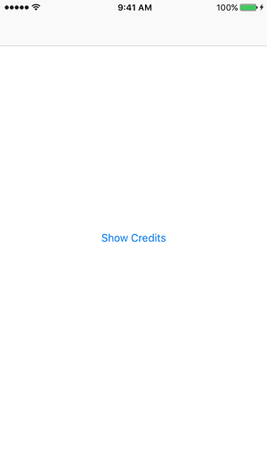

# Credits
A simple way to display third-party attributions in an iOS project.



## Installation

### CocoaPods
[CocoaPods](http://cocoapods.org) is a dependency manager for Cocoa projects. You can install it with the following command:

```bash
$ gem install cocoapods
```

To integrate Credits into your Xcode project using CocoaPods, specify it in your `Podfile`:

```ruby
source 'https://github.com/CocoaPods/Specs.git'
platform :ios, '10.0'
use_frameworks!

target '<Your Target Name>' do
pod 'Credits'
end
```
Then, run the following command:

```bash
$ pod install
```
Be sure to add a "Copy Framework" step in Xcode > Project > Target > Build Phases


# Example
See the included example for how to instantiate, but this is a simple example:
```swift
// Load plist file in an array for the parser to use
let licensePath = Bundle.main.path(forResource: "licenses", ofType: "plist")
// Create a new license parser
let parser = LicenseParser(licensePath: licensePath!)
// Create a new Credits view controller
let controller = CreditsViewController.creditsViewController(parser: parser!)
present(controller, animated: true, completion: nil)
```
# License Property List Format
The license file must be a Property List using the following format:
```xml
<?xml version="1.0" encoding="UTF-8"?>
<!DOCTYPE plist PUBLIC "-//Apple//DTD PLIST 1.0//EN" "http://www.apple.com/DTDs/PropertyList-1.0.dtd">
<plist version="1.0">
<array>
<dict>
<key>title</key>
<string>SomeThirdPartyLibraryTitle</string>
<key>link</key>
<string>https://github.com/SomeThirdPartyLibraryTitle</string>
<key>content</key>
<string>Copyright (c) 2014-2016... (rest of license contents)
</string>
</dict>
</array>
</plist>
```

`title` is replaced by the title of the third-party project.

`link` is a link to whereever the project is (e.g. GitHub).

`content` is the license file content.

# Custom HTML
You can load custom body and content HTML for display in the web view as follows:
```html
// Custom body and content HTML
let bodyHTMLPath = Bundle.main.path(forResource: "license-body", ofType: "html")
let contentHTMLPath = Bundle.main.path(forResource: "license-content", ofType: "html")
let parser = LicenseParser(licensePath: licensePath, licenseHTMLBodyPath: bodyHTMLPath, licenseHTMLContentPath: contentHTMLPath)
```
The body HTML must contain the flagged variable `$CONTENT` which is replaced by the parsed license file content.
```html
<!DOCTYPE html>
<html lang="en">
<body>
<div>
The following sets forth attribution notices for third party software that may be contained in portions of this product.
</div>
$CONTENT
</body>
</html>

```
The content HTML (for each individual license) contains three flags as shown in the example:
```html
<div class="license-title">
$TITLE
<div class="license-link">$LINK</div>
</div>
<div class="license-content">
$CONTENT <!-- Wrap each license in <p></p> for proper formatting -->
</div>
```
`$TITLE` is replaced by the title of the third-party project.

`$LINK` is a link to whereever the project is (e.g. GitHub).

`$CONTENT` is the license file content.

# License
Credits is released under the MIT license. See LICENSE for details.
